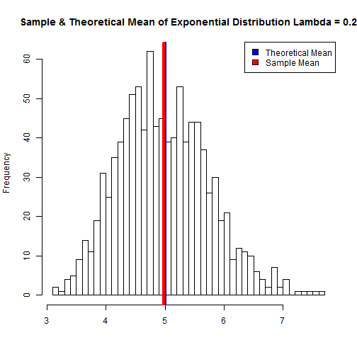

This is Bill Seliger's submission for the Peer Assessment Project, Part 1, for the Coursera-Johns Hopkins Statistical Inference class. In this assignment I will use simulation to explore the Central Limit Theorem and the sample means of a distribution.

For more details on this project see the original assignment here:
 <https://class.coursera.org/statinference-011/human_grading/view/courses/973519/assessments/4/submissions>.

I will investigate the exponential distribution in R and show how the Central Limit Theorem can be applied. The exponential distribution can be simulated in R with rexp(n, lambda) where lambda is the rate parameter. The mean of exponential distribution is 1/lambda and the standard deviation is also 1/lambda. I will let lambda = 0.2 for all of the simulations. I will investigate the distribution of averages of 40 exponentials. I will write the R code to perform a thousand simulations to show the effect of the Central Limit Theorem.

The following R code sets parameters that will be used to simulate the exponential distribution and the theoretical mean, standard deviation, and variance for this distribution:

```r
lambda <- 0.2
sample_size <- 40
simulations <- 1000
theoretical_mean <- 1/lambda
theoretical_sd <- 1/lambda/sqrt(sample_size)
theoretical_var <- (1/lambda)^2
means_value = NULL  ## set the means object to NULL to assure we start with a clean slate
sample_means = NULL  ## set the means object to NULL to assure we start with a clean slate
sample_var = NULL  ## set the variance object to NULL to assure we start with a clean slate
```

The following code creates 1000 simulations of a sample size of 40 drawn from the exponential distribution and records the means of those samples in a object, sample_means

```r
for (i in 1 : simulations) {
values <- rexp(sample_size, lambda)
mean_value <- mean(values)
sample_means <- c(sample_means, mean_value)
}
```


### Sample Mean comparison to Theoretical Mean

This histogram shows the frequenciy of the mean of 1000 simulations.  The mean of the sample_means is the vertical line in red and the theoretical mean of the distribution is the vertical line in blue (which may be difficult to read as the two lines fall almost perfectly on top of one another).  It can be aldo be observed that disbution of the sample means is quite Gaussian and is extremely close to the theoretical mean of the distribution.

```r
hist(sample_means, breaks = 40,
  xlab = "",
  main = "Sample & Theoretical Mean of Exponential Distribution Lambda = 0.2")
abline(v = theoretical_mean, col = "BLUE", lwd = 4)
abline(v = mean(sample_means), col = "RED", lwd = 4)
legend("topright", c("Theoretical Mean", "Sample Mean"), fill = c("blue","red"))
```

 


Because the sample size, 40, and number of simulations, 1000, is high the sample mean is very close to the theoretical mean of the distribution.  The sample mean is ``4.9759549`` and the theoretical mean of the distribution is ``5`` (the theoretical mean of the distribution is 1/lambda = 1/0.2 = 5)

###Sample Variance compared to Theoretical Variance


```r
sample_sd <- sd(sample_means)
sample_var <- var(sample_means)
```

The Sample Variance is ``0.5826662`` and the Theoretical Variance is ``25``.  In the course we learned that the variance of the sampling distribution of the sample mean is equal to the variance of population (or theoretical) distribution / n.  The analysis here holds true here with ``25`` / ``40`` = ``0.625``


###Sample Density compared to Normal Distribution

The below Quantile-Quantile plot shows the quantiles of the sample means to the quantiles of the normal distribution.  This shows that the sample density is very close in approximation to the normal distribution.  

```r
xfit <- seq(2, 8, 0.1)
yfit <- dnorm(xfit, mean = theoretical_mean, sd = theoretical_sd)
hist(sample_means, breaks = 40, prob = TRUE,
  xlab = "",
  main = "Sample Density compared to Normal Distribution")
lines(density(sample_means), col = "RED", lwd = 4)
lines(xfit, yfit, col="blue", lwd = 4)
legend("topright", c("Normal Distribution", "Sample Density"), fill = c("blue","red"))
```

 


A Quantile-Quantile plot also shows how the distribution of the sample means is normal.  The below code 'centers' the sample means at 0 by subtracting the mean of the sample_means from each observation, essentially setting the mean of the sample means at 0.

```r
adj_sample_means <- sample_means - mean(sample_means)
```


This qqplot and qqline plot the quantiles of the sample means to the population or theoretical quantiles.  

```r
qqnorm(adj_sample_means, col = "red")
qqline(adj_sample_means, col = "black")
```

 


This plot shows that the distribution of the sample means is very closely related to the theoretical quantiles, therefore the distribution of the sample means is normal.  


